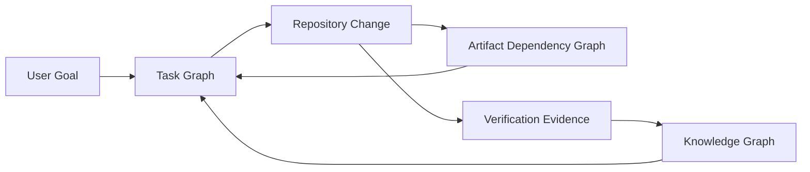
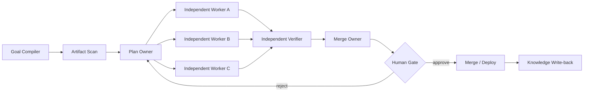

# Architecture

## 1. なぜ3種類のGraphを分離するか

Task、Knowledge、Artifactは更新頻度と責務が異なります。1つの巨大Graphへ押し込むと、短命な実行状態と長期保存する技術知識が混ざり、検索・更新・監査が難しくなります。



### Task Graph

今回の作業実行計画です。Nodeは調査・設計・実装・検証などのJob、Edgeは実行依存です。作業完了後は監査ログとして残せますが、Graphの主目的は実行制御です。

### Knowledge Graph

不具合、原因、修正、制約、Unityバージョン、Platform差、計測結果、出典を長期保存します。Factは必ずsource、time、confidenceを持ちます。

### Artifact Dependency Graph

Unity Project内の構造です。SceneからPrefab、PrefabからMaterial、MaterialからShader、ShaderからHLSL、ScriptからAPIという依存を表します。Task Graphは変更対象から影響範囲とVerifierを決定するために利用します。

## 2. 実行フロー



## 3. Graph Edgeの基準

Edgeは「後段のNodeが前段の成果を実際に読む場合」だけ作ります。単に文章上で「その後」と続くだけの処理はFake Edgeです。

Unity例:

- Repository Scan → Implementation Plan: Scan結果を読むため実Edge
- Unity公式API調査 → Shader見た目レビュー: 調査結果を読まないならFake Edge
- Shader変更 → Material/Scene検証: 変更結果に依存するため実Edge

## 4. Writer Ownership

同じファイルへ複数Workerが書き込むことを禁止します。

```yaml
ownership:
  Assets/Shaders/**: rendering-worker
  Assets/Editor/**: tooling-worker
  ProjectSettings/**: project-worker
  Packages/manifest.json: package-worker
```

境界をまたぐ変更はPlan Ownerが1つのWorkerへ統合するか、ファイル単位で明示的に分割します。

## 5. Verifier

Verifierは実装者と別Contextで動き、感想ではなくEvidenceを返します。

- Compile: error / warning / assembly boundary
- EditMode / PlayMode tests
- UnityEditor APIのRuntime流入
- Missing reference / GUID / meta
- Scene・Material・Shaderの見た目
- Frame Debugger、RenderDoc、Profilerなどの計測
- Platform固有のBuildと実機結果

## 6. Human Gate

次のように巻き戻しコストが高い操作だけをHuman Gateへ通します。

- PR merge
- mainへの直接push
- package release
- SceneやProjectSettingsの大規模置換
- Asset削除
- Build配布

## 7. 初期実装の境界

Phase 0では`AssetDatabase.GetDependencies`から得られるAsset依存のみを扱います。C# call graph、SerializedPropertyの意味解析、Shader Pass、RendererFeature実行順序、Build Variantは後続Phaseで追加します。
