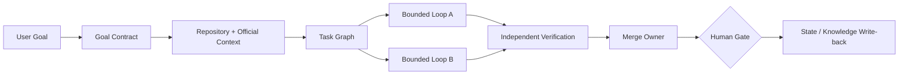

# Architecture

## 1. System Boundary

Unity Graph EngineeringはUnity Editor内で動くGraph製品ではない。AI AgentがUnity Repositoryへ変更を加える際の制御系である。



Unity Projectは変更対象であり、Graph EngineのHostではない。

## 2. Responsibilities

### Goal Contract

自然言語の依頼を機械判定可能な契約へ変える。

- Deliverables
- Acceptance criteria
- Must / Must not
- Unity / Pipeline / Platform
- Required evidence
- Human gates
- Explicit assumptions

### Task Graph

今回の仕事のTopology。

- Node: 1担当へ渡せるJob
- Edge: 後段が前段Outputを読む実行依存
- State: Job status、attempt、evidence、next action
- Merge Owner: Output統合の単一責任者

### Loop

Action Node内部の反復。

```text
Input → Action → Observe → Evaluate → Continue | Approve | Reject | Escalate
```

Loopは上限、停止条件、Evaluatorを必ず持つ。

### Skills

Unity固有の再利用可能な手順・規約。Skillは具体的なTriggerを持ち、長いReferenceは別Fileへ分離する。

### Verifier

Makerと別ContextでAcceptance Contractを評価する。VerifierはSourceを修正しない。

### State / Knowledge

- State: 現在のGoal、Node、Attempt、Failure、Next Action
- Knowledge: Version、Platform、Sourceを持つ再利用可能なFact

Chat履歴を唯一のState Storeにしない。

## 3. Graph and Loop Composition

Task Graphは外側、Loopは内側。

```text
Task Graph Node: Implement Shader

  Attempt 1
    edit → compile → capture → REJECT
  Attempt 2
    new hypothesis → edit → compile → capture → APPROVE
```

複数NodeをLoopで無秩序に往復させない。RoutingはWorkflowに記述し、AgentはJobを実行する。

## 4. Parallelism

並列化する条件:

- Output依存がない
- Write Scopeが重ならない
- Merge Ownerが存在する
- Verificationが分離される

Unityでの安全な例:

```text
                  ┌─ Repository conventions ─┐
Goal Contract ────┼─ Unity official API ─────┼─→ Plan Owner
                  └─ Platform constraints ───┘
```

Unityで逐次に残す例:

- Shader interface → dependent pass implementation
- Baseline capture → optimization
- Root cause confirmation → fix
- Scene pass → visual correction

## 5. Maker / Checker Boundary

Makerが渡すもの:

- Diff
- Expected result
- Commands/tests run
- Evidence artifacts
- Known risks

Checkerが返すもの:

```text
APPROVE | REJECT | ESCALATE_HUMAN
```

CheckerはMakerの説明を信頼せず、Goal ContractとEvidenceから判定する。

## 6. Human Gate

HumanをすべてのNodeへ置かない。巻き戻しCostが高いActionに限定する。

- merge / push main
- Asset deletion
- Scene large replacement
- ProjectSettings
- Render Pipeline Asset
- Package changes
- Build distribution

`gate.yaml`がDefault Policyを定義する。

## 7. State Spine

各Runは開始時にStateを読み、終了時に書き戻す。

```yaml
run_id: ...
workflow: ...
status: running
nodes:
  - id: implement
    status: rejected
    attempts: 1
    failure_signature: shader variant missing
next_action: inspect stripped variant evidence
```

Stateは上書き可能なCurrent View、`loop-run-log.md`はAppend-only Historyとして扱う。

## 8. Optional Artifact Context

Asset依存、C# Call、Shader Pass、RenderGraph ResourceなどのArtifact情報はTask Graphを補助できる。ただし必須Runtimeではない。

- Scoped searchで十分ならGraphを生成しない
- Artifact Scannerの結果だけで変更判断しない
- Unity Editor ToolをCore Productにしない

## 9. Target Repository Integration

対象Unity Repositoryへ置く最小File:

```text
AGENTS.md
PROJECT_CONTEXT.md
STATE.md
KNOWLEDGE.md
LOOP.md
.codex/agents/unity-verifier.toml   # Codexの場合
```

Orchestrator SkillとWorkflowはUnity-Graph-Engineering側を参照する。
